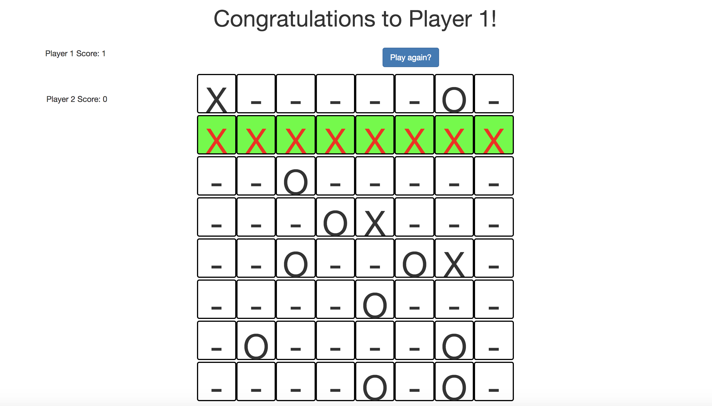

## Tic-tac-toe
Classic tic-tac-toe game in which a player can play with another person or the computer. Users also have the opportunity to play on virtually any sized square playing table.

## Github Link:
[Tic-tac-toe GitHub](https://github.com/eddieatkinson/tic-tac-toe)

## Technologies used:
**Languages:**
* JavaScript
* HTML5
* CSS

**Frameworks:**
* Bootstrap

## Code snippets:
Win-check for any-sized square:
``` javascript
// ---Create winning array---
for (let i = 0; i < sideLength; i++){
  allWinningRows[i] = [];
    for (let j = 0; j < sideLength; j++){
        allWinningRows[i].push(`${i}${j}`); // Rows
    }
}
for (let i = 0; i < sideLength; i++){
  allWinningColumns[i] = [];
    for (let j = 0; j < sideLength; j++){
        allWinningColumns[i].push(`${j}${i}`); // Columns
    }
}
for (let i = 0; i < sideLength; i++){
    for (let j = 0; j < sideLength; j++){
        if(j == i){
            allWinningDiags[0].push(`${i}${j}`);
        }
    }
}
for (let i = (sideLength - 1); i >= 0; i--){
    for (let j = (sideLength - 1); j >= 0; j--){
        if(i + j == sideLength - 1){
            allWinningDiags[1].push(`${i}${j}`);
            break;
        }
    }
}
var allWinningCombos = allWinningRows.concat(allWinningColumns, allWinningDiags);

function checkWin(currentPlayerSquares, playerNum){
    for (let i = 0; i < allWinningCombos.length; i++){
        var squareCount = 0;
        for (let j = 0; j < allWinningCombos[i].length; j++){
            var winningSquare = allWinningCombos[i][j];
            if(currentPlayerSquares.indexOf(winningSquare) !== -1){
                squareCount++;
            }
        } 
        if(squareCount == sideLength){
            endGame(allWinningCombos[i], playerNum);
            break;
            
        }
    }
}
```
Computer-move:
``` javascript
function computerMove(){
    var squareFound = false;
    while(!squareFound){
        rand = Math.floor(Math.random() * sideLength * sideLength);
        var isTaken = squares[rand].innerHTML;
        if(isTaken === '-'){
            squareFound = true;
        }
    }
    markSquare(squares[rand]);
}
```

## Screenshots:


